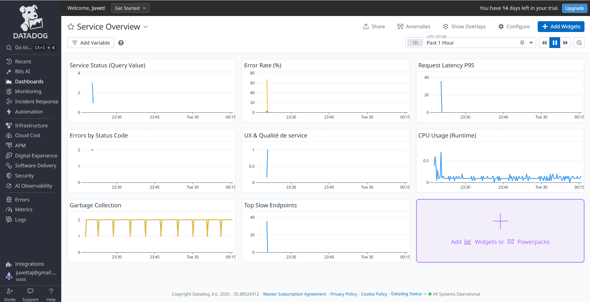
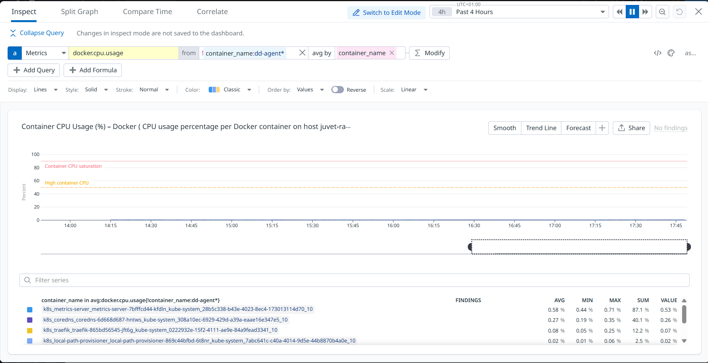
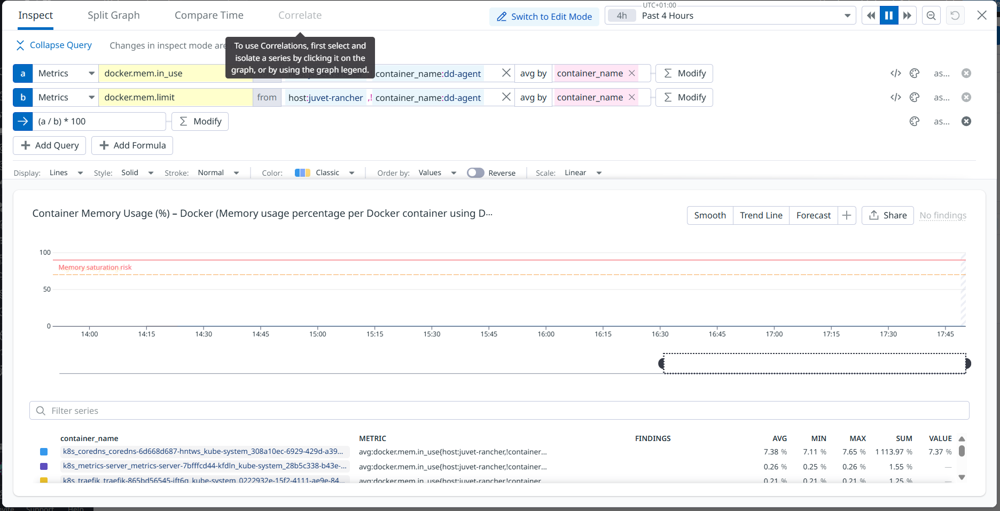
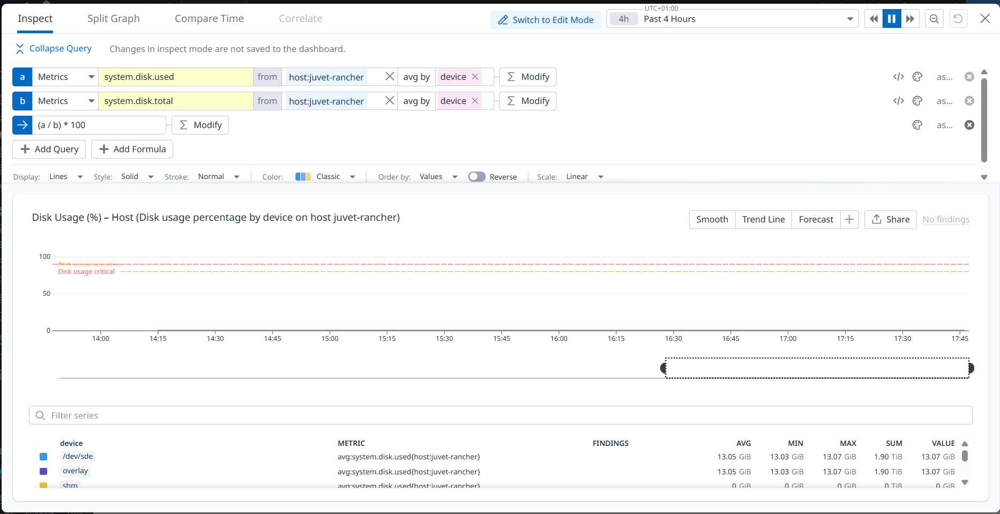
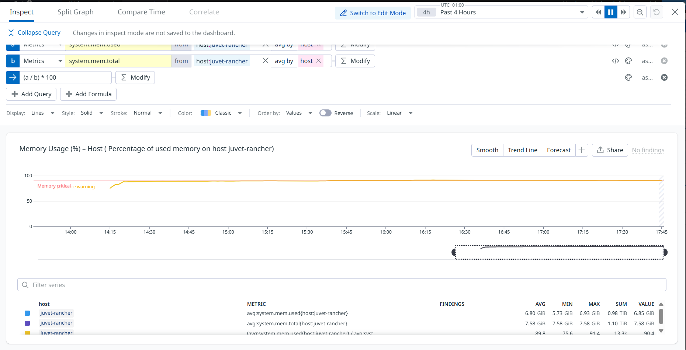
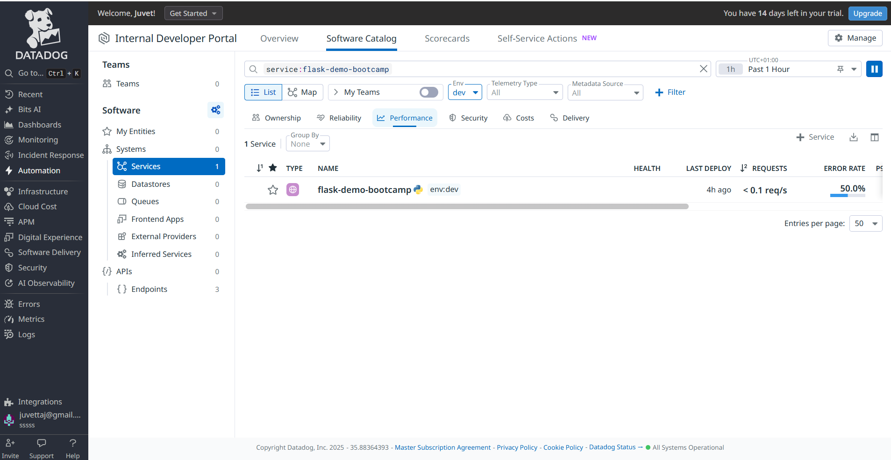
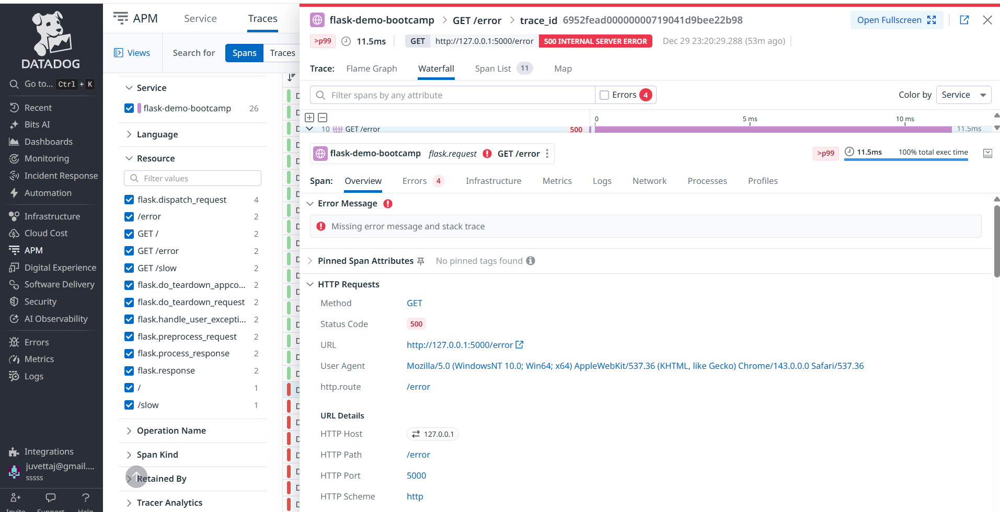
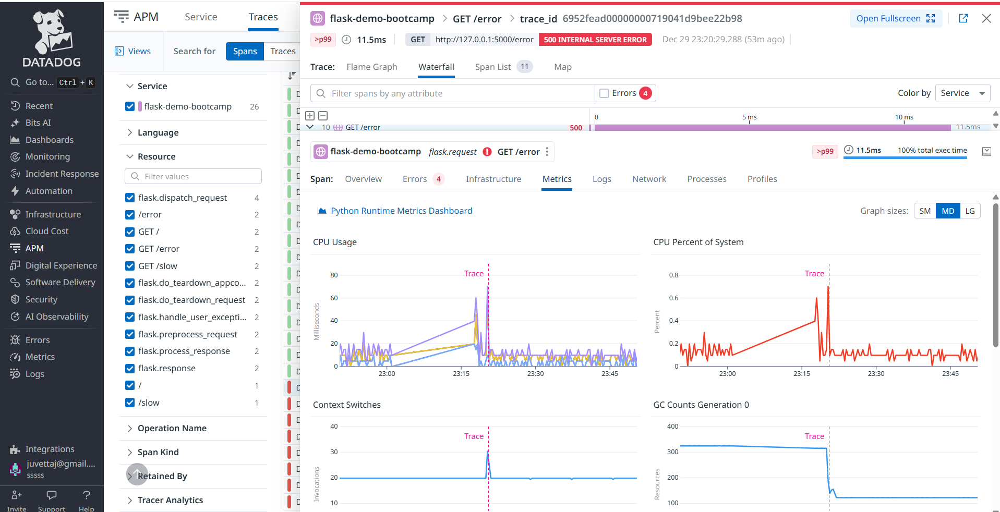

#  Datadog – Observabilité Infrastructure & Containers

---

##  Résumé Exécutif

Ce document présente la mise en place d'un système de surveillance informatique complet pour garantir le bon fonctionnement de serveurs et d'applications.

**Ce qui a été réalisé :**

1. **Surveillance des serveurs** 
   - Installation d'un "agent" (programme de surveillance) sur le serveur
   - Mesure en temps réel de l'utilisation du processeur, de la mémoire et du disque dur
   - Création d'alertes automatiques quand les ressources atteignent des seuils critiques (ex: CPU > 80%)

2. **Surveillance d'une application Flask** 
   - Instrumentation d'une application web Python pour tracer son comportement
   - Détection automatique des ralentissements et des erreurs
   - Corrélation entre les logs (journaux) et les performances

3. **Tableaux de bord** 
   - Interface visuelle pour voir en un coup d'œil l'état de santé du système
   - Graphiques des métriques importantes avec seuils d'alerte colorés
   - Historique des événements pour comprendre les incidents

**Bénéfices :**
- Détection rapide des problèmes avant qu'ils n'impactent les utilisateurs
- Capacité à diagnostiquer les causes racines d'une panne
- Visibilité complète sur l'infrastructure et les applications

---

##  Objectif

Mettre en place une solution d'observabilité avec Datadog afin de :
- superviser les ressources système (CPU, mémoire, disque)
- monitorer les containers Docker
- configurer des alertes pertinentes
- construire un dashboard exploitable en contexte production

---

##  Captures d'écran

### Dashboard Datadog

Le dashboard personnalisé regroupe l'ensemble des métriques critiques pour l'observabilité de l'infrastructure :

#### Vue d'ensemble


#### Container CPU Usage
Surveillance de l'utilisation CPU par container Docker avec seuils d'alerte (saturation à 80%, alerte haute à 60%).



#### Container Memory Usage
Monitoring de la consommation mémoire des containers avec calcul du ratio utilisation/limite et détection des risques de saturation.



#### Disk Usage
Suivi de l'utilisation disque par device sur l'hôte `juvet-rancher` avec seuil critique à 95%.



#### Host Memory Usage
Analyse de la mémoire système avec indication du niveau critique (80%) et zone d'avertissement (warning).



#### Host CPU Usage (User vs System)
Comparaison entre CPU utilisateur et CPU système pour identifier les goulots d'étranglement.


### Agent Status


---

##  Contexte

- **Outil** : Datadog (Agent v7)
- **Environnement** :
   - Ubuntu 24.04 LTS
   - WSL2
   - Rancher Desktop (Docker + Kubernetes local)
- **Périmètre observé** :
   - Host Docker (`juvet-rancher`)
   - Containers locaux
- **Datadog Site** : `datadoghq.eu`

---

##  Implémentation

### Installation de l'agent Datadog (Docker)

L'agent Datadog a été déployé sous forme de container Docker, solution la plus adaptée à un environnement WSL / Rancher Desktop.

```bash
docker run -d --name dd-agent \
   -e DD_API_KEY=<API_KEY> \
   -e DD_SITE=datadoghq.eu \
   -e DD_HOSTNAME=juvet-rancher \
   -e DD_DOGSTATSD_NON_LOCAL_TRAFFIC=true \
   -e DD_NETWORK_ENABLED=false \
   -v /var/run/docker.sock:/var/run/docker.sock:ro \
   -v /sys/fs/cgroup/:/host/sys/fs/cgroup:ro \
   -v /var/lib/docker/containers:/var/lib/docker/containers:ro \
   gcr.io/datadoghq/agent:7
```

**Choix techniques :**
- Agent Docker plutôt que bare-metal pour éviter les problèmes de hostname sous WSL
- Désactivation du network check (`DD_NETWORK_ENABLED=false`) pour éviter l'erreur `/host/proc/net/dev`
- Hostname forcé pour cohérence dashboards / alertes

### Vérification de l'agent

```bash
docker exec -it dd-agent agent status
```

**Résultat :**
- Agent connecté à Datadog
- Métriques système collectées
- Containers détectés
- Events Docker visibles

---

##  Dashboard Datadog

Création d'un dashboard personnalisé avec une approche progressive :

### Widgets implémentés
- CPU Usage (%) avec threshold
- CPU Saturation (%) via formule
- Memory Usage
- Memory Saturation
- Disk Usage
- Container Restarts
- Event Stream (Docker & Agent)

**Objectif** : passer de la métrique brute à une lecture claire des incidents.

---

##  Alerting

### Monitor CPU – High Usage

- **Métrique** : `system.cpu.user`
- **Scope** : `host:juvet-rancher`
- **Condition** : > 80 % sur 5 minutes
- **Options** :
   - Require full window
   - Pas d'alerte en cas de données manquantes

**Message :**
```
High CPU usage detected on {{host.name}}
CPU usage has been above 80% for more than 5 minutes.
```

---

##  Résultat

- Supervision complète de l'hôte Docker
- Visibilité claire sur l'activité des containers
- Alertes pertinentes et exploitables
- Corrélation métriques / événements facilitant le diagnostic

**Livrables :**
- Dashboard Datadog
- Widgets avec seuils
- Monitor CPU
- Captures d'écran associées

---

##  Ce que j'ai appris

### Concepts clés
- Observabilité vs monitoring
- Architecture de l'agent Datadog
- Métriques infrastructure et containers
- Construction de dashboards orientés exploitation

### Bonnes pratiques
- Définir des seuils réalistes
- Ajouter du contexte via les événements
- Adapter l'agent à l'environnement (WSL, Docker)
- Nommer clairement dashboards et alertes

### Points à approfondir
- APM et traces distribuées
- Centralisation des logs
- Intégration Kubernetes avancée
- Alertes multi-dimensionnelles

---

#  Application Flask – APM et Observabilité Applicative

## Objectif

Mettre en place une observabilité complète (APM, Logs, Metrics) pour une application Flask conteneurisée avec Datadog.

---

## Stack technique

* Python 3.11 / Flask
* Docker & Docker Compose
* Datadog Agent (APM, Logs, Runtime Metrics)
* ddtrace (APM Python)
* datadog (StatsD client)

---

##  Architecture du projet

```
app-demo/
├── app.py                    # Application Flask instrumentée
├── docker-compose.yaml       # Orchestration des services
├── Dockerfile               # Image Python avec ddtrace
├── requirements.txt         # Dépendances Python
└── .env.example            # Template des variables d'environnement
```

---

##  Application Flask améliorée

### Endpoints exposés

* `GET /` : Page d'accueil avec informations du service
* `GET /health` : Health check pour monitoring
* `GET /slow` : Requête lente simulée (0.5-2s)
* `GET /compute` : Calculs intensifs avec span custom
* `GET /error` : Génération d'erreur pour tester le monitoring
* `GET /metrics` : Affichage des métriques du service

### Fonctionnalités d'observabilité

#### 1. **Logging structuré**
```python
logging.basicConfig(
    level=logging.INFO,
    format='%(asctime)s - %(name)s - %(levelname)s - %(message)s'
)
```

#### 2. **Traces APM avec ddtrace**
```python
@tracer.wrap(service=DD_SERVICE, resource="compute")
def compute():
    with tracer.trace("computation.task", service=DD_SERVICE) as span:
        result = sum(i * i for i in range(10000))
        span.set_tag("computation.result", result)
```

#### 3. **Métriques custom**
```python
# Compteurs
statsd.increment('flask.request.count', tags=[f'env:{ENV}', f'endpoint:{path}'])

# Histogrammes
statsd.histogram('flask.request.duration', duration, tags=[...])

# Gauges
statsd.gauge('flask.active.requests', active_count)
```

#### 4. **Middlewares de tracking**
```python
@app.before_request
def before_request():
    request.start_time = time.time()
    logger.info(f"[{ENV}] Request: {request.method} {request.path}")

@app.after_request
def after_request(response):
    duration = time.time() - request.start_time
    # Envoi automatique des métriques
```

#### 5. **Gestion d'erreurs**
```python
@app.errorhandler(404)
@app.errorhandler(500)
# Handlers personnalisés avec métriques

---

##  Captures Datadog

### APM – Service Flask


### Traces


### Runtime Metrics


### Dashboard


---

##  Configuration Docker

### docker-compose.yaml

Configuration complète avec agent Datadog et application Flask :

```yaml
version: "3.8"

services:
  dd-agent:
    image: datadog/agent:latest
    container_name: dd-agent
    environment:
      - DD_API_KEY=${DD_API_KEY}
      - DD_SITE=${DD_SITE:-datadoghq.eu}
      - DD_DOGSTATSD_NON_LOCAL_TRAFFIC=true
      - DD_APM_ENABLED=true
      - DD_APM_NON_LOCAL_TRAFFIC=true
      - DD_LOGS_ENABLED=true
      - DD_LOGS_CONFIG_CONTAINER_COLLECT_ALL=true
    volumes:
      - /var/run/docker.sock:/var/run/docker.sock:ro
      - /proc/:/host/proc/:ro
      - /sys/fs/cgroup/:/host/sys/fs/cgroup:ro
    ports:
      - "8126:8126"  # APM
      - "8125:8125/udp"  # StatsD
    networks:
      - datadog-net

  flask-apm:
    build: .
    container_name: flask-apm
    environment:
      - DD_SERVICE=${DD_SERVICE:-flask-demo-bootcamp}
      - DD_ENV=${DD_ENV:-dev}
      - DD_VERSION=1.0
      - DD_AGENT_HOST=dd-agent
      - DD_TRACE_AGENT_PORT=8126
      - DD_DOGSTATSD_PORT=8125
    ports:
      - "5000:5000"
    depends_on:
      - dd-agent
    networks:
      - datadog-net

networks:
  datadog-net:
    driver: bridge
```

### Variables d'environnement (.env)

```env
DD_API_KEY=votre_cle_api_datadog
DD_SITE=datadoghq.eu
DD_SERVICE=flask-demo-bootcamp
DD_ENV=dev
```

---

##  Instrumentation Datadog

### Dépendances (requirements.txt)

```txt
flask==3.0.0
ddtrace==2.5.0
datadog==0.49.1
psutil==5.9.6
requests==2.31.0
```

### Commande de lancement

```bash
ddtrace-run python app.py
```

### Variables Datadog clés

#### APM (Application Performance Monitoring)
```env
DD_SERVICE=flask-demo-bootcamp
DD_ENV=dev
DD_VERSION=1.0
DD_AGENT_HOST=dd-agent
DD_TRACE_AGENT_PORT=8126
DD_TRACE_ENABLED=true
DD_APM_ENABLED=true
```

#### Logs
```env
DD_LOGS_INJECTION=true  # Injection automatique trace_id dans les logs
```

#### Runtime Metrics
```env
DD_RUNTIME_METRICS_ENABLED=true
DD_RUNTIME_METRICS_RUNTIME_ID_ENABLED=true
```

#### Profiling
```env
DD_PROFILING_ENABLED=true
```

#### StatsD (métriques custom)
```env
DD_DOGSTATSD_PORT=8125
```

---

##  Métriques collectées

### Métriques automatiques (ddtrace)

* **Traces** : Toutes les requêtes HTTP Flask
* **Spans** : Détail des opérations (fonctions, calculs, I/O)
* **Erreurs** : Capture automatique des exceptions
* **Latence** : P50, P75, P95, P99

### Métriques custom (StatsD)

| Métrique | Type | Description | Tags |
|----------|------|-------------|------|
| `flask.request.count` | Counter | Nombre de requêtes | env, method, endpoint, status |
| `flask.request.duration` | Histogram | Durée des requêtes (s) | env, method, endpoint |
| `flask.endpoint.*` | Counter | Compteur par endpoint | env |
| `flask.endpoint.slow.delay` | Histogram | Délai du endpoint slow | env |
| `flask.error.*` | Counter | Compteurs d'erreurs | env, error_type |
| `flask.active.requests` | Gauge | Requêtes actives | env |

### Runtime Metrics (Python)

* CPU utilisé par le process Python
* Mémoire consommée (RSS, VMS)
* Garbage Collection (collections, objets)
* Threads actifs
* Context switches

---

##  Datadog Agent

### Fonctionnalités actives

* **APM** : Collecte des traces distribuées
* **Logs** : Collecte des logs containers Docker
* **Runtime Metrics** : Métriques Python (CPU, mémoire, GC)
* **StatsD** : Réception des métriques custom
* **Container Monitoring** : Surveillance des containers Docker

### Configuration clé

```yaml
DD_DOGSTATSD_NON_LOCAL_TRAFFIC=true  # Accepte les métriques de tous les containers
DD_APM_NON_LOCAL_TRAFFIC=true        # Accepte les traces de tous les containers
DD_LOGS_CONFIG_CONTAINER_COLLECT_ALL=true  # Collecte tous les logs Docker
```

### Vérification de l'agent

```bash
# Status complet
docker exec -it dd-agent agent status

# Vérifier APM
docker exec -it dd-agent agent status | grep -A 20 "APM Agent"

# Vérifier DogStatsD
docker exec -it dd-agent agent status | grep -A 10 "DogStatsD"

# Vérifier les logs
docker exec -it dd-agent agent status | grep -A 10 "Logs Agent"
```

**Résultats attendus :**
-  Agent connecté à Datadog EU
-  APM actif et collectant des traces
-  StatsD recevant des métriques
-  Logs des containers collectés
-  Runtime metrics Python visibles

---

##  Démarrage du projet

### 1. Configuration

```bash
cd datadog/app-demo

# Copier le template des variables d'environnement
cp .env.example .env

# Éditer .env avec votre clé API Datadog
nano .env
```

### 2. Lancement

```bash
# Build et démarrage des services
docker-compose up --build

# Ou en arrière-plan
docker-compose up -d --build
```

### 3. Tests des endpoints

```bash
# Endpoint principal
curl http://localhost:5000

# Health check
curl http://localhost:5000/health

# Endpoint lent (0.5-2s)
curl http://localhost:5000/slow

# Calculs intensifs
curl http://localhost:5000/compute

# Génération d'erreur
curl http://localhost:5000/error

# Métriques du service
curl http://localhost:5000/metrics
```

### 4. Génération de charge (optionnel)

```bash
# Script bash pour générer du trafic
for i in {1..100}; do
  curl -s http://localhost:5000 > /dev/null
  curl -s http://localhost:5000/slow > /dev/null
  curl -s http://localhost:5000/compute > /dev/null
  sleep 0.1
done
```

---

##  Observabilité obtenue

### 1. **APM (Application Performance Monitoring)**

 **Traces par endpoint Flask**
- Vue détaillée de chaque requête HTTP
- Temps d'exécution par étape
- Identification des goulots d'étranglement

 **Flamegraph et Waterfall**
- Visualisation graphique du temps d'exécution
- Identification des fonctions lentes
- Hiérarchie des appels

 **Détection automatique des erreurs**
- Capture des exceptions Python
- Stack traces complètes
- Corrélation erreur ↔ trace ↔ logs

 **Mesures de latence**
- P50, P75, P95, P99, Max
- Analyse des régressions de performance
- Alertes sur dégradation

 **Spans custom**
- Traçage de sections spécifiques du code
- Mesure de calculs intensifs
- Tags personnalisés pour filtrage

### 2. **Logs**

 **Logs applicatifs Flask**
- Tous les logs Python collectés
- Format structuré avec timestamp
- Niveaux : DEBUG, INFO, WARNING, ERROR

 **Corrélation Logs ↔ Traces**
- Injection automatique du `trace_id`
- Navigation directe log → trace
- Context complet lors du debug

 **Logs containers**
- Logs stdout/stderr de Flask
- Logs de l'agent Datadog
- Métadonnées Docker (container_name, image, etc.)

### 3. **Runtime Metrics**

 **Métriques Python**
- CPU par thread
- Mémoire RSS, VMS, Heap
- Garbage Collector (collections, objets)
- Context switches

 **Corrélation avec les traces**
- Pic CPU → quelle requête ?
- Memory leak → quel endpoint ?
- GC pause → impact latence

### 4. **Métriques Custom**

 **Business metrics**
- Compteur de requêtes par endpoint
- Taux de succès/erreur
- Distribution des codes HTTP

 **Performance metrics**
- Durée par endpoint
- Distribution des latences
- Requêtes actives en temps réel

---

##  Dashboards Datadog

### Dashboard Infrastructure (déjà créé)

Indicateurs système suivis :
* CPU Usage (%) avec threshold
* CPU Saturation via formule
* Memory Usage et saturation
* Disk Usage par device
* Container CPU/Memory
* Container Restarts
* Event Stream (Docker & Agent)

### Dashboard Application Flask (à créer)

Widgets recommandés :

#### 1. **Request Rate**
- Métrique : `flask.request.count` (counter)
- Visualisation : Timeseries
- Group by : `endpoint`, `status`

#### 2. **Request Duration (P95)**
- Métrique : `flask.request.duration` (histogram P95)
- Visualisation : Timeseries
- Threshold : > 1s (warning), > 2s (critical)

#### 3. **Error Rate**
- Métrique : `flask.error.count` / `flask.request.count`
- Visualisation : Query Value
- Formula : `(errors / total) * 100`
- Threshold : > 1% (warning), > 5% (critical)

#### 4. **Status Code Distribution**
- Métrique : `flask.request.count`
- Visualisation : Top List ou Pie Chart
- Group by : `status`

#### 5. **Endpoint Performance**
- Métrique : `flask.request.duration` (avg, p95)
- Visualisation : Table
- Group by : `endpoint`
- Sort by : P95 descending

#### 6. **Python Runtime**
- Métriques :
  - `runtime.python.cpu.user`
  - `runtime.python.mem.rss`
  - `runtime.python.gc.collections`
- Visualisation : Timeseries combiné

#### 7. **Active Traces**
- Source : APM
- Service : `flask-demo-bootcamp`
- Visualisation : Trace Stream avec filtres

#### 8. **Error Logs**
- Source : Logs
- Query : `status:error service:flask-demo-bootcamp`
- Visualisation : Log Stream

---

##  Monitors et Alertes

### 1. Monitor : High Error Rate

**Objectif** : Alerter si le taux d'erreur dépasse 5%

```
Metric: flask.error.count
Formula: (sum:flask.error.count{*} / sum:flask.request.count{*}) * 100
Condition: > 5 for 5 minutes
Alert message: "Error rate is {{value}}% (threshold: 5%)"
```

### 2. Monitor : High Latency P95

**Objectif** : Alerter si la latence P95 dépasse 2 secondes

```
Metric: flask.request.duration (p95)
Condition: > 2 seconds for 10 minutes
Alert message: "P95 latency is {{value}}s on endpoint {{endpoint.name}}"
```

### 3. Monitor : Service Down

**Objectif** : Alerter si aucune requête reçue pendant 5 minutes

```
Metric: flask.request.count
Condition: no data for 5 minutes
Alert message: "Flask service appears to be down - no requests in 5 min"
```

### 4. Monitor : High Memory Usage

**Objectif** : Alerter si la mémoire Python dépasse 500 MB

```
Metric: runtime.python.mem.rss
Condition: > 500000000 (bytes) for 10 minutes
Alert message: "Python memory usage: {{value}} bytes"
```

---

##  Scénarios de test

### Test 1 : Performance nominale
```bash
# 100 requêtes normales
for i in {1..100}; do curl http://localhost:5000; done
```
**Résultat attendu :**
- Latence P95 < 100ms
- Taux d'erreur = 0%
- Traces visibles dans APM

### Test 2 : Dégradation de performance
```bash
# 50 requêtes lentes
for i in {1..50}; do curl http://localhost:5000/slow; done
```
**Résultat attendu :**
- Latence P95 > 1s
- Spans `sleep.operation` visibles
- Pics CPU dans runtime metrics

### Test 3 : Gestion d'erreurs
```bash
# 20 erreurs générées
for i in {1..20}; do curl http://localhost:5000/error; done
```
**Résultat attendu :**
- Taux d'erreur > 0%
- Exceptions capturées dans APM
- Logs d'erreur avec stack trace
- Métrique `flask.error.count` incrémentée

### Test 4 : Charge soutenue
```bash
# Charge pendant 5 minutes
for i in {1..1000}; do
  curl -s http://localhost:5000 &
  curl -s http://localhost:5000/compute &
  sleep 0.5
done
```
**Résultat attendu :**
- Métriques runtime stables
- Pas de memory leak
- GC actif mais pas bloquant
- Tous les endpoints répondent

---

##  Résultats et livrables

###  Infrastructure observée
- Supervision complète de l'hôte Docker
- Visibilité sur les containers
- Alertes pertinentes CPU/Memory/Disk
- Corrélation métriques ↔ événements

###  Application instrumentée
- APM complet avec traces
- Métriques custom business et performance
- Logs corrélés avec trace_id
- Runtime metrics Python
- Gestion d'erreurs robuste

###  Dashboards opérationnels
- Dashboard infrastructure (système)
- Dashboard application (Flask)
- Widgets avec seuils et alertes
- Vue d'ensemble exploitable

###  Alerting configuré
- Monitors CPU, Memory, Disk
- Monitors applicatifs (erreurs, latence)
- Messages contextualisés
- Escalade définie

###  Livrables techniques
```
datadog/
├── app-demo/
│   ├── app.py                    # Application Flask instrumentée
│   ├── docker-compose.yaml       # Orchestration complète
│   ├── Dockerfile               # Image optimisée
│   ├── requirements.txt         # Dépendances
│   └── .env.example            # Template configuration
└── images/
    ├── dashboard.png
    ├── apm-service.png
    ├── trace.png
    └── runtime-metrics.png
```

---

##  Apprentissages clés

### Concepts maîtrisés

#### Observabilité vs Monitoring
- **Monitoring** : "Est-ce que ça marche ?" (métriques prédéfinies)
- **Observabilité** : "Pourquoi ça ne marche pas ?" (traces, logs, contexte)

#### Les 3 piliers de l'observabilité
1. **Métriques** : Mesures agrégées (CPU, latence, taux d'erreur)
2. **Traces** : Parcours des requêtes (spans, flamegraphs)
3. **Logs** : Événements détaillés (erreurs, debug)

#### Instrumentation
- **Auto-instrumentation** : ddtrace détecte automatiquement Flask
- **Instrumentation manuelle** : spans custom, tags, métriques
- **Trade-off** : Overhead vs visibilité

#### Corrélation
- trace_id dans les logs → navigation directe
- Tags cohérents → filtrage efficace
- Context propagation → traces distribuées

### Bonnes pratiques appliquées

#### Code
 Variables d'environnement pour la configuration
 Logging structuré avec contexte
 Gestion d'erreurs avec métriques
 Spans custom pour les opérations critiques
 Tags pertinents sur toutes les métriques

#### Infrastructure
 Agent Datadog en container
 Réseau Docker dédié
 Health checks configurés
 Volumes pour persistance si nécessaire

#### Monitoring
 Seuils réalistes basés sur l'observation
 Alertes avec contexte exploitable
 Dashboards orientés diagnostic rapide
 Corrélation entre les différentes sources

### Patterns d'observabilité

#### Request Tracing Pattern
```python
@tracer.wrap(service=SERVICE, resource="operation")
def operation():
    with tracer.trace("sub-operation") as span:
        span.set_tag("key", "value")
```

#### Metrics Pattern
```python
# Before
start = time.time()

# Operation
result = do_work()

# After
duration = time.time() - start
statsd.histogram('operation.duration', duration, tags=[...])
statsd.increment('operation.success', tags=[...])
```

#### Error Handling Pattern
```python
try:
    result = risky_operation()
    statsd.increment('operation.success')
except SpecificError as e:
    logger.exception("Operation failed")
    statsd.increment('operation.error', tags=[f'error:{type(e).__name__}'])
    raise
```

---

##  Compétences acquises

### Techniques
- [x] Installation et configuration agent Datadog
- [x] Instrumentation APM Python avec ddtrace
- [x] Envoi de métriques custom via StatsD
- [x] Configuration de logs structurés
- [x] Création de dashboards Datadog
- [x] Configuration de monitors et alertes
- [x] Corrélation traces/logs/métriques
- [x] Docker Compose multi-services
- [x] Variables d'environnement et secrets

### Conceptuelles
- [x] Observabilité vs monitoring
- [x] Les 3 piliers (métriques/traces/logs)
- [x] Traces distribuées et spans
- [x] Sampling et overhead
- [x] SLI, SLO, SLA (initié)
- [x] Alerting et on-call (principes)
- [x] Golden signals (latence, trafic, erreurs, saturation)

---

##  Points à approfondir

### Court terme
- [ ] Création de SLO (Service Level Objectives)
- [ ] Alertes multi-dimensionnelles avancées
- [ ] Profiling continu (flamegraphs CPU)
- [ ] Synthetic monitoring (tests externes)
- [ ] RUM (Real User Monitoring) si frontend

### Moyen terme
- [ ] Intégration Kubernetes
- [ ] Service mesh (Istio/Linkerd) + Datadog
- [ ] Distributed tracing multi-services
- [ ] Log pipelines et parsing custom
- [ ] Anomaly detection avec machine learning

### Long terme
- [ ] Chaos engineering avec observabilité
- [ ] Cost optimization basé sur les métriques
- [ ] Incident management workflow
- [ ] Observability as Code (Terraform)
- [ ] OpenTelemetry migration

---

##  Ressources utiles

### Documentation officielle
- [Datadog APM Python](https://docs.datadoghq.com/tracing/setup_overview/setup/python/)
- [DogStatsD](https://docs.datadoghq.com/developers/dogstatsd/)
- [Datadog Agent](https://docs.datadoghq.com/agent/)

### Best practices
- [APM Best Practices](https://docs.datadoghq.com/tracing/guide/metrics_namespace/)
- [Dashboard Best Practices](https://docs.datadoghq.com/dashboards/guide/)
- [Alerting Best Practices](https://docs.datadoghq.com/monitors/guide/)

### Communauté
- [Datadog Learning Center](https://learn.datadoghq.com/)
- [Datadog GitHub](https://github.com/DataDog)

---
